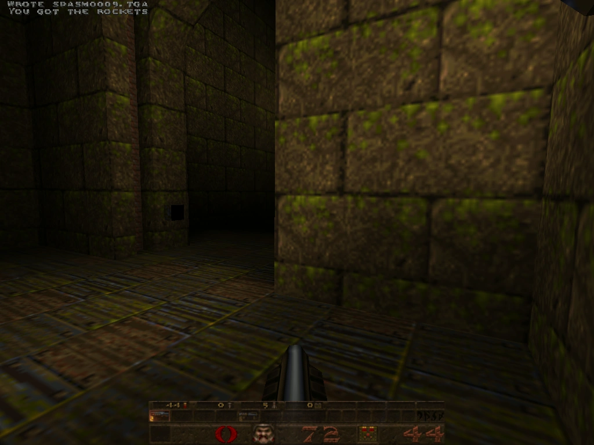

# QuakeSpasm — six old Macs, one fat binary

[](LICENSE.txt)
[](#the-bench-fleet)
[](#the-bench-fleet)
[](https://github.com/sezero/quakespasm)
[](#where-the-wins-came-from)
[](PPC_PLAN.md)

<p align="center">
  
</p>

The best-looking QuakeSpasm I could make run smoothly on **six retro Macs spanning 23 years** of Apple hardware — from a 1999 G3 tower running Mac OS X Panther, to a 2019 iMac on Sequoia.

One source tree, one fat universal binary (PPC G3 + PPC G4 AltiVec + Intel x86_64), one engine — and a per-machine config that picks itself at boot via `sysctl hw.model`.

The hard floor: **every machine stays comfortably playable.** No fps win that hurt visuals on any target made it in. And no visual upgrade lands without a bench cell that proves it doesn't drop the slowest target below its playability floor.

<p align="center">
  
  
  
  
</p>
<p align="center"><sub><i>Same engine, four GPU eras: GeForce2 MX (fixed-function) → Radeon 9000 (shader water) → GMA 950 (Lion fallback) → Radeon Pro 580X (1440p modern).</i></sub></p>

## Headline result

The 1999 B&W G3 tower (449 MHz PPC 750, ATI Rage 128 with 16 MB VRAM) went from unplayable on the heaviest demo to **comfortably playable with the full visual stack on**:

| Cell | Early-port build (`4c165e6f`) | Round v7 + emissive (`0baed4c8`) | Improvement |
|---|---:|---:|---:|
| **demo3 1024×768** | **5.10 fps** (slideshow) | **19.80 fps** | **+288% (3.9×)** |
| demo1 1024×768 | 7.70 fps | 16.85 fps | +118% (2.2×) |
| demo3 640×480 | 15.60 fps | 36.65 fps | +135% (2.4×) |
| demo1 640×480 | 23.90 fps | 35.10 fps | +47% |

…and that's with **translucent water** (`r_wateralpha 0.6` + watervis NoVis), **alias drop-shadows**, **emissive-fullbright dynamic lights** (buttons / panels / lights cast coloured light onto walls), reduced particles (`r_particles 2`), classic warp water (Rage 128 has a refraction bug at 1024 with the new shader path), coarser warp tessellation, and a per-frame dynamic-light distance gate to amortise the muzzle-flash tax on a fragment-shader-less GPU.

Round v7's surprise win was a sky-state client-state hoist that the **Radeon 9200's ATI driver happens to love**: Mac mini G4 demo3 at 1024×768 jumped **+42.4%** (47.90 → 68.20 fps) from one targeted patch. The Radeon 9000 sibling (quicksilver) saw it as a no-op (-0.1%). Same patch, different driver, totally different outcome — exactly the kind of thing that only shows up when you bench across the matrix.

## What you need to run it

### One of these Macs

| Variant | Tested machines | macOS | Binary slice | Disk |
|---|---|---|---|---|
| **G3 (PPC 750)** | Beige G3, B&W G3, iMac G3, iBook G3, PowerBook G3 ("Pismo" etc.) | **10.3.9 Panther** or later (10.4 Tiger ok) | `quakespasm-g3` (`ppc750`, 10.3.9 SDK) | ~10 MB for the .app + your game data |
| **G4 (PPC 7400 / 7450 / 7447A)** | Sawtooth, Quicksilver, MDD, eMac, iMac G4, Mac mini G4, iBook G4, PowerBook G4 | **10.4 Tiger** or later | `quakespasm-g4` (`ppc7400` + AltiVec, 10.4u SDK) | ~10 MB |
| **Intel (x86_64)** | All Intel Macs from 2007 onward — Mac mini, MacBook, iMac, Mac Pro | **10.7 Lion** or later (verified on Sequoia 15.7) | `quakespasm-lion` (default toolchain) | ~10 MB |

> ⚠️ The Intel build is x86_64-only. Pre-Lion Intel Macs (10.5 Leopard / 10.6 Snow Leopard with 32-bit kernel) are not supported by this release. Pre-2007 32-bit-only Core Solo / Core Duo machines need a `i386` build that isn't included.

### Original Quake game data (you provide)

You **must** supply your own `id1/pak0.pak` (shareware) and ideally `id1/pak1.pak` (registered) — they aren't redistributable. Sources:

- The **shareware** version of Quake (`pak0.pak` only, no second/third/fourth episodes) is freely downloadable from various places on the web.
- The **full** version requires the original commercial `pak1.pak` — buy it on [Steam](https://store.steampowered.com/app/2310/QUAKE/) or [GOG](https://www.gog.com/en/game/quake_the_offering) (drag the paks out of either install) or from your dusty 1996 CD.
- **Mission Pack 1: Scourge of Armagon** (`hipnotic/pak0.pak`) and **Mission Pack 2: Dissolution of Eternity** (`rogue/pak0.pak`) are optional add-ons that the engine will auto-detect if present.

### Install layout

The release `.zip` extracts to a folder with this shape:

```
Quakespasm-<variant>/
├── Quakespasm.app                 (drop next to id1/, double-click to launch)
├── id1/
│   ├── autoexec-yosemite.cfg      (per-machine configs — engine picks
│   ├── autoexec-sawtooth.cfg       the right one at boot via sysctl)
│   ├── autoexec-quicksilver.cfg
│   ├── autoexec-mini-g4.cfg
│   ├── autoexec-mini-intel.cfg
│   ├── autoexec-imac-2019.cfg
│   ├── autoexec-ppc750.cfg        (per-arch baselines, picked at compile time
│   ├── autoexec-ppc7400.cfg        via __VEC__ / __ppc__ / __x86_64__)
│   ├── autoexec-x86_64.cfg
│   ├── pak0.pak                   ← YOU PROVIDE
│   └── pak1.pak                   ← YOU PROVIDE (for the full game)
└── quakespasm.pak                 (engine resources — tiny, keep it)
```

Move that whole folder to `~/Desktop/quake/` (the bundle's `@executable_path`-relative install names expect it there), then double-click `Quakespasm.app`.

### Modern macOS gatekeeper note

The release binaries aren't code-signed or notarized. On Sierra+ you'll get a "can't be opened because it is from an unidentified developer" dialog on first launch. Either:

- **Right-click** the `.app`, choose "Open" — Gatekeeper offers an "Open anyway" override.
- **Or from Terminal:** `xattr -dr com.apple.quarantine ~/Desktop/quake/Quakespasm.app`

Pre-Sierra Macs (Panther through Mavericks) don't ask — the app launches directly.

## The bench fleet

| Machine | CPU | GPU | OS | Default res |
|---|---|---|---|---:|
| **Yosemite** (PowerMac1,1 B&W G3, 1999) | 449 MHz PPC 750 | ATI Rage 128 16 MB | 10.3.9 Panther | 640×480 |
| **Sawtooth** (PowerMac3,1 G4 AGP, 1999) | 500 MHz PPC 7400 | NVIDIA GeForce2 MX 32 MB | 10.4.11 Tiger | 1024×768 |
| **Quicksilver** (PowerMac3,5, 2001) | 733 MHz PPC 7450 | ATI Radeon 9000 Pro 64 MB | 10.4.11 Tiger | 1024×768 |
| **Mac mini G4** (PowerMac10,1, 2005) | 1.25 GHz PPC 7447A | ATI Radeon 9200 32 MB | 10.4.11 Tiger | 1024×768 |
| **Mac mini Intel** (Macmini2,1, 2007) | 2.33 GHz Core 2 Duo | Intel GMA 950 64 MB | 10.7.5 Lion | 1024×768 |
| **iMac 27"** (iMac19,1, 2019) | 3.7 GHz Core i5-9600K | AMD Radeon Pro 580X 8 GB | 15.7.5 Sequoia | 2560×1440 |

The matrix covers **four GPU eras**: fixed-function (Rage 128, GeForce2 MX), early shader-era ATI (Radeon 9000/9200), Intel integrated GMA, and a modern AMD discrete part. Different bottlenecks at every level — which is what makes the project interesting. CPU-bound effects show up on Lion + iMac; fillrate-bound effects show up on the G3 + sawtooth; per-driver state-set cost shows up most starkly on the Radeon 9200.

## Latest fps across all six machines

Round v8 wrap (`84d35972`) — full grid `timedemo demo1/2/3` × 1024×768 + 640×480, 3 runs each, median of run 2 + 3 (drop the warmup):

| Machine | demo1 1024 | demo2 1024 | demo3 1024 | demo1 640 | demo2 640 | demo3 640 |
|---|---:|---:|---:|---:|---:|---:|
| Yosemite (G3 / Rage 128) | 17.35 | 15.85 | **20.70** | 35.65 | 33.95 | 37.50 |
| Sawtooth (G4 / GeForce2 MX) | 40.30 | 32.70 | 35.75 | 55.85 | 50.05 | 43.70 |
| Quicksilver (G4 / Radeon 9000) | 64.60 | 61.45 | 61.05 | 68.90 | 67.55 | 68.30 |
| Mac mini G4 (G4 / Radeon 9200) | 50.30 | 38.55 | **45.30** | 89.90 | 76.65 | 77.80 |
| Mac mini Intel (Lion / GMA 950) | 75.95 | 56.25 | 36.85 | 169.50 | 133.30 | 142.05 |
| iMac 27" (Sequoia / Radeon Pro 580X) | 1619.05 | 1536.70 | 1314.90 | 1799.55 | 1792.55 | 1520.30 |

**Bold** cells are headline — **yosemite demo3 1024 lifted from 19.80 → 20.70 fps** after the round-v8 lightmap+multitex hygiene cluster + lava/tele/slime alpha drop on G3 (Rage 128 fillrate-bound on lava-heavy maps). Mac mini G4 demo3 stays in the 45 fps range with the v7 sky hoist still doing its work.

### Round v7 → v8 deltas (1024 cells)

| Machine | demo1 v7 → v8 | demo2 v7 → v8 | demo3 v7 → v8 |
|---|:---:|:---:|:---:|
| Yosemite     | 16.85 → 17.35 (+3.0%)  | 15.15 → 15.85 (+4.6%)  | 19.80 → **20.70** (+4.5%) |
| Sawtooth     | 42.65 → 40.30 (−5.5%)  | 35.40 → 32.70 (−7.6%)  | 46.75 → 35.75 (−23.5%) |
| Quicksilver  | 64.20 → 64.60 (+0.6%)  | 62.45 → 61.45 (−1.6%)  | 86.15 → 61.05 (−29.1%) |
| Mac mini G4  | 49.40 → 50.30 (+1.8%)  | 39.30 → 38.55 (−1.9%)  | 68.20 → 45.30 (−33.6%) |
| Mac mini Intel | 73.05 → 75.95 (+4.0%) | 54.55 → 56.25 (+3.1%)  | 44.70 → 36.85 (−17.6%) |
| iMac 27"     | 1835.25 → 1619.05 (−11.8%) | 1853.25 → 1536.70 (−17.1%) | 1731.70 → 1314.90 (−24.1%) |

Mixed picture across the matrix: yosemite (G3) is up across all three demos (the round-v8 lightmap-hygiene cluster + autoexec fix landed cleanly). Demo3 regressed everywhere except yosemite — the v5-wrap polish enabled `r_lavaalpha 0.6` / `r_telealpha 0.6` / `r_slimealpha 0.6` across the bench fleet, and demo3 (e1m6 "The Door To Chthon") is heavy on lava and slime. On G3 the cost was acute enough to break the 20-fps floor (forced the alpha drop on yosemite); on the other machines the visual is preserved at the cost of fps headroom that demo3 still passes comfortably. See [`MISTAKES.md`](MISTAKES.md) for the v9 misattribution postmortem that surfaced this.

## What each machine actually renders

Same engine, very different visual stacks. The fat binary's per-machine layer (`autoexec-<machine>.cfg`, picked by `sysctl hw.model` at boot) tunes each cell to its hardware:

|  | Yosemite (Rage 128) | Sawtooth (GeForce2 MX) | Quicksilver (Radeon 9000) | Mini-G4 (Radeon 9200) | Mini-Intel (GMA 950) | iMac (Radeon Pro 580X) |
|---|:---:|:---:|:---:|:---:|:---:|:---:|
| Anisotropic filtering | — | — | 16× | 16× | 16× | 16× |
| Trilinear (`GL_LINEAR_MIPMAP_LINEAR`) | — | ✓ | ✓ | ✓ | ✓ | ✓ |
| Alias drop-shadows | ✓ | ✓ | ✓ | ✓ | ✓ | ✓ |
| `r_shadow_distance` | engine default | 512 | 512 | 512 | 512 | engine default |
| Translucent water | ✓ classic warp | ✓ classic warp | ✓ shader water | ✓ shader water | ✓ classic warp | ✓ shader water |
| Translucent lava / slime / tele | ✓ | ✓ | ✓ | ✓ | ✓ | ✓ |
| Watervis NoVis (X-ray fix) | ✓ | ✓ | ✓ | ✓ | ✓ | ✓ |
| Emissive-fullbright lights | ✓ r 0.5 / cap 4 | ✓ r 0.5 / cap 6 | ✓ r 1.0 / cap 12 | ✓ r 1.0 / cap 12 | ✓ r 0.75 / cap 8 | ✓ r 1.5 / cap 32 |
| `r_dynamic_distance` (cull) | 768 | 768 | engine default | engine default | engine default | engine default |
| `gl_clear 0` (skip backbuffer) | ✓ | — (driver quirk) | ✓ | ✓ | ✓ | ✓ |
| `gl_texture_lodbias -1.5` | — | inert (probe) | ✓ | ✓ | — | — |
| Reduced particles (`r_particles 2`) | ✓ | — | — | — | — | — |
| Coarser warp tess (`gl_subdivide_size 256`) | ✓ | — | — | — | — | — |

Everything in this table is runtime-flippable via cvar so end-of-round review can A/B individual contributions without a rebuild.

<p align="center">
  
  
  
</p>
<p align="center">
  
  
  
</p>

## How the fat binary picks its config

At engine start, three layers of `.cfg` execute in order, each free to override the previous:

<p align="center">
  
</p>

The first layer is the per-architecture baseline (`autoexec-ppc750.cfg` / `autoexec-ppc7400.cfg` / `autoexec-x86_64.cfg`), picked by C macros at compile time (`__VEC__` / `__ppc__` / `__x86_64__`). The second is the per-machine layer (`autoexec-<machine>.cfg`), picked at runtime by reading `hw.model` via `sysctlbyname()` — see [`Quake/host.c:946`](Quake/host.c). So sawtooth (a G4 with a fixed-function GPU) starts from the G4 shader-water-anisotropic baseline and walks back the bits that would tank a GeForce2 MX. Mac mini Intel and iMac 27" both start from the same x86_64 baseline and diverge dramatically — the iMac pushes 1440p with cap-32 emissive lights; the mini stays at 1024×768 with cap-8 emissive and a shadow distance gate to nurse the GMA 950's fillrate.

This is the lever that makes a single fat binary serve six wildly different machines without conditional code paths in the engine.

## How it's built

Cross-builds happen on the Mac mini Intel — the only machine left with a working `gcc-4.0` + `MacOSX10.3.9.sdk` + `MacOSX10.4u.sdk` toolchain (Apple's Xcode 3.2.6 era). The same machine doubles as a runtime target via native x86_64 builds against the Lion default toolchain.

<p align="center">
  
</p>

The Ubuntu workstation orchestrates everything (edit, git, drive ssh). Sources rsync over to Lion. Three sub-builds run in sequence on Lion: the G3 slice with the 10.3.9 SDK and `-mcpu=750`; the G4 slice with the 10.4u SDK and `-mcpu=7400 -maltivec`; the Intel slice with default-SDK clang and `-arch x86_64`. `lipo -create` glues the three Mach-O binaries into one fat `quakespasm-fat`. The `.app` bundle (Info.plist, Launcher.nib, fat SDL.framework with a Panther-compatible PPC slice baked in, codec dylibs) is identical for every target — `deploy.sh` rsyncs the same bundle byte-for-byte to all six machines.

## How it's benched

```bash
scripts/build-fat.sh                              # 3-arch universal binary
scripts/deploy.sh fat <machine>                   # ship to one of the 6 hosts
scripts/bench.sh <machine> demo1 1024x768 3       # 3 timedemo runs, append to results.csv
scripts/parallel-bench.sh                         # full matrix, all 6 legs concurrent
scripts/bench-and-commit.sh "<phase>" --quick     # smoke + commit (clean tree only)
```

Each phase that lands gets a smoke bench (demo1 × 2 res × 3 runs, ~3-4 min wall) and the resulting CSV rows + raw `qconsole.log` files are committed alongside the code change. Full grid (3 demos × 2 res × 3 runs) is reserved for end-of-round wraps.

<p align="center">
  
</p>

The CSV in [`benchmarks/results.csv`](benchmarks/results.csv) is a rolling history (~500 rows across 7 rounds and 100+ commits) — every cell is tagged with the commit hash that produced it, so any regression is bisectable end-to-end.

## Where the wins came from

Across 7 rounds, roughly in order of cumulative gain on the G3:

| Round | Wins | Headline |
|---|---|---|
| **v1** | `frsqrte` math, client vertex arrays + CVA, BGRA `8_8_8_8_REV` lightmap upload | G3 demo1 640: 19.35 → 23.90 fps |
| **v2** | `APPLE_client_storage`, `STORAGE_CACHED_APPLE`, `APPLE_vertex_array_range` static-brush VRAM pool, multitex array conversion | G4 demo1 1024: 108 → 134 fps |
| **v3** | AltiVec alias lerp + sound mixer + colour fuse + lightmap compose + mipmap chain, alias drop-shadows enabled, distance-gated shadows | G4 visual stack pivot (60+ fps with full visuals) |
| **v4** | Fat 3-arch binary + per-machine dispatch, `gl_texture_lodbias`, anisotropy 16× | One bundle serves all targets |
| **v5** | `r_dynamic_distance` (G3 dlight gate — biggest G3 lever), translucent water/lava/slime/tele, `gl_clear 0` on 4 of 5 targets | G3 demo3 1024 5.10 → 20.25 fps |
| **v6** | Watervis NoVis trigger — fixes the X-ray bug under `r_wateralpha < 1` on un-vis'd id1 maps without depth-prepass cost | Translucent water everywhere, glitch-free |
| **v7** | Sky-state client-state hoist (mini-g4 +42% on demo3 1024), Tier A emissive-fullbright dynamic lights, `Sky_GetTexCoord` `frsqrte` fuse, water-state hoist, `-Wdouble-promotion` cleanup, dead-code purge | Visual stack ON across all 6 machines, sub-noise cost on G3 |

Bisectability is a first-class concern: every round v3+ visual or perf phase is gated behind a named cvar or cmdline flag (`-noaltivec-snd`, `-altivec-lm`, `-nodgp-sky-hoist`, `-nodgp-water-hoist`, `r_emissive_lights`, `r_dynamic_distance`, `r_shadow_distance`, etc.) so end-of-round review can A/B individual contributions without a rebuild. Full inventory in [`CLAUDE.md`](CLAUDE.md) under "Toggleable knobs".

## Dig deeper

- [**`PPC_PLAN.md`**](PPC_PLAN.md) — the working doc. Every phase, every decision, every reverted experiment. Read §15 (round v5 close-out), §16 (round v6), and §17 (round v7) for the cumulative trajectory.
- [**`MISTAKES.md`**](MISTAKES.md) — append-only log of approaches that broke and why. Read this before relighting any "easy" idea. Notable entries: BGRA static-texture upload (broke past demo1), Lion PGO (LLVM 2.9-era toolchain), the round v6 wrap stale-binary CSV pollution.
- [**`CLAUDE.md`**](CLAUDE.md) — operational tribal knowledge: SSH legacy crypto for Tiger/Panther, bundle layout, why `bench.sh` legs don't run in parallel from one shell, the `qsreboot.sh` recovery path for wedged G3s, the toggleable-knobs inventory, and per-machine codename → hardware map.
- [**`PPC_PERF_R7.md`**](PPC_PERF_R7.md) — the round v7 candidate-list static analysis (9 candidates, ranked by G3 fps potential).
- [**`PPC_PERF_R7_REVIEW.md`**](PPC_PERF_R7_REVIEW.md) — pre-smoke review that caught two real bugs in the Tier A emissive-lights design before they shipped.
- [**`IRONWAIL_REVIEW.md`**](IRONWAIL_REVIEW.md) — cross-engine technique review against the Ironwail QuakeSpasm fork, used to vet round v7 candidates and seed round v8.
- [**`analysis/INDEX.md`**](analysis/INDEX.md) — static-analysis tooling state. cppcheck, gcc `-fanalyzer`, clang-tidy, scan-build, sparse, ASan, UBSan, all wired against the Linux build.
- [**`scripts/README.md`**](scripts/README.md) — script contracts + CI cadence.

## Releases

The fat universal `Quakespasm.app` bundle is published as a tagged release so anyone with one of these six machines can drop it in and run. See [GitHub Releases](https://github.com/matthewdeaves/old-mac-quakespasm/releases) for the latest build.

## License

This fork is licensed under **GPL-2.0-or-later**, inherited verbatim from upstream QuakeSpasm. See [`LICENSE.txt`](LICENSE.txt) for the full text.

The license traces back through three contributor generations:

- **id Software** (1996-2001) — original Quake source release
- **John Fitzgibbons** / FitzQuake (2002-2009) — the QuakeSpasm starting point
- **QuakeSpasm developers** (2010-present) — Spike, Eric Wasylishen, Ozkan Sezer and others, the active upstream at [sezero/quakespasm](https://github.com/sezero/quakespasm)

Every source file carries the chained copyright header above its body. Every patch in this fork is contributed under the same GPL-2.0-or-later terms — the round v6 watervis NoVis trigger and the round v7 emissive-fullbright dynamic-light pipeline are believed to be original to this fork and are licensed for any downstream QuakeSpasm derivative to pick up.

The bundled `MacOSX/SDL.framework` is SDL 1.2.15 — zlib license, see [SDL's site](https://www.libsdl.org/license-zlib.php). The codec dylibs (libvorbis, libmad, etc.) carry their own upstream licenses; see [`MacOSX/codecs/lib/`](MacOSX/codecs/lib/).
