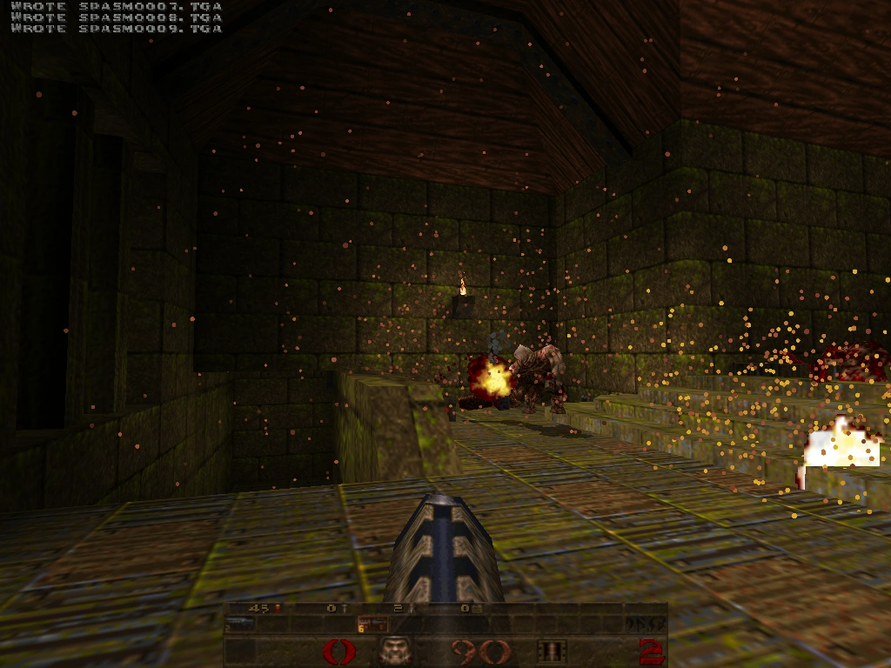
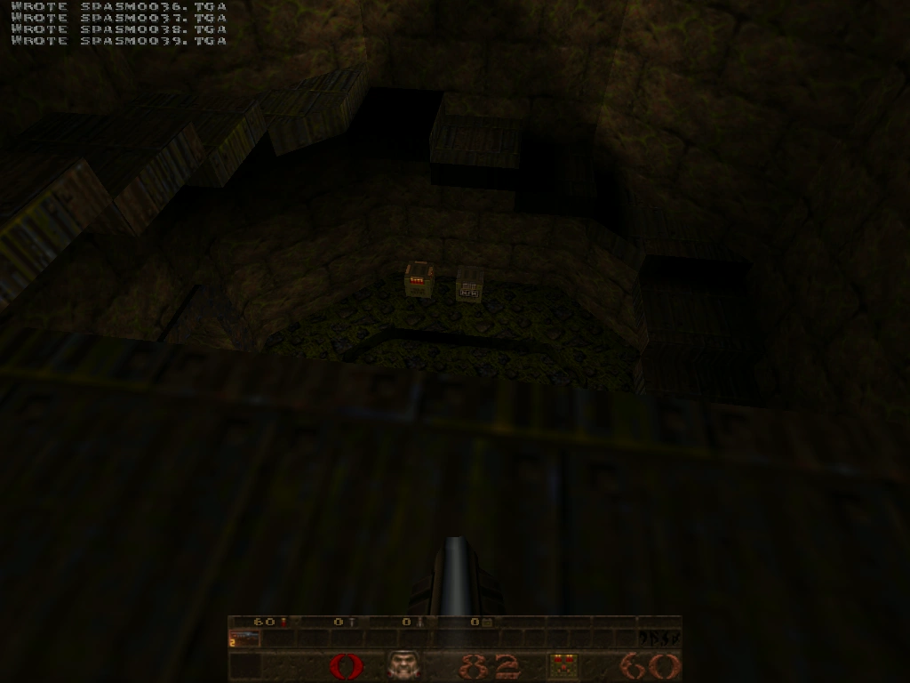
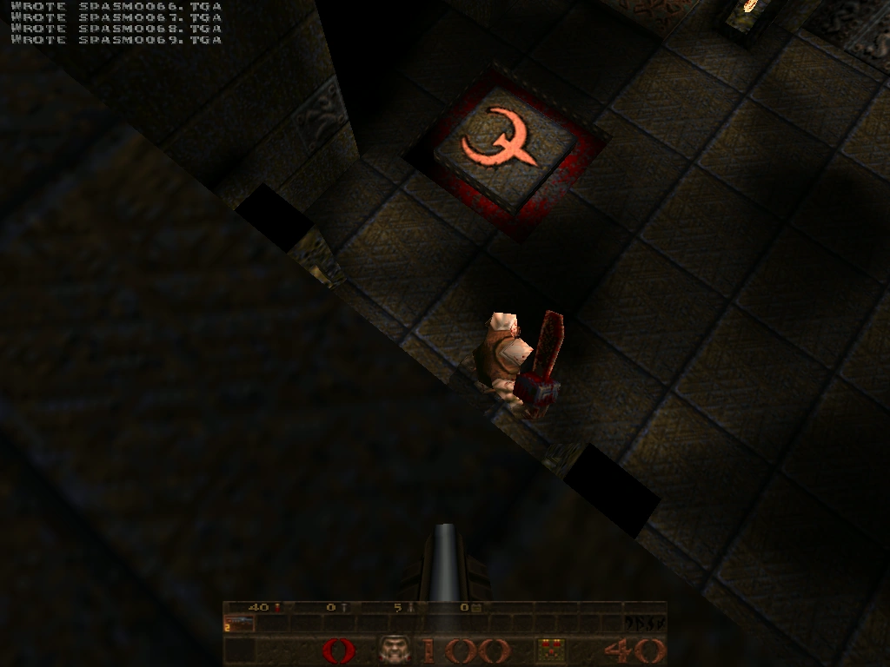
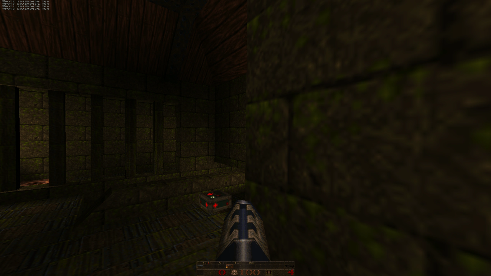
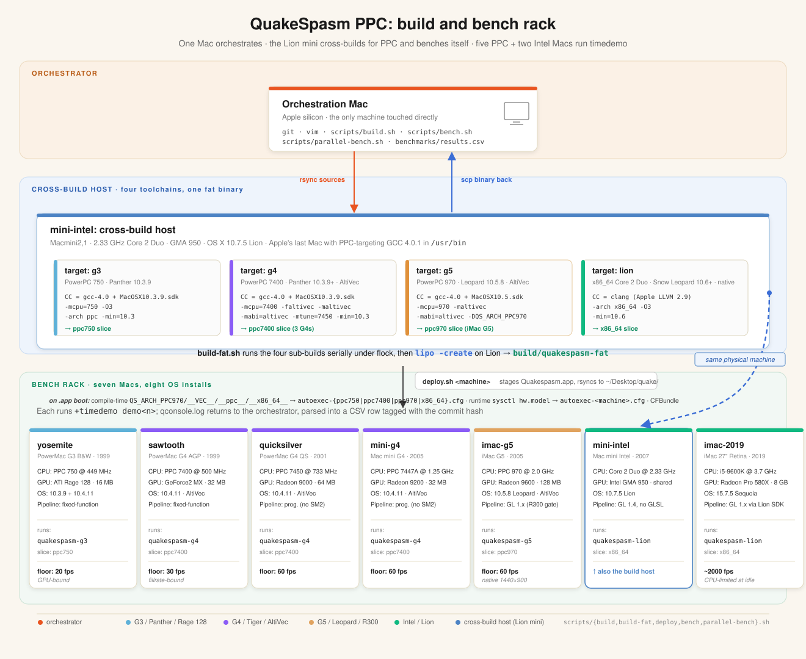
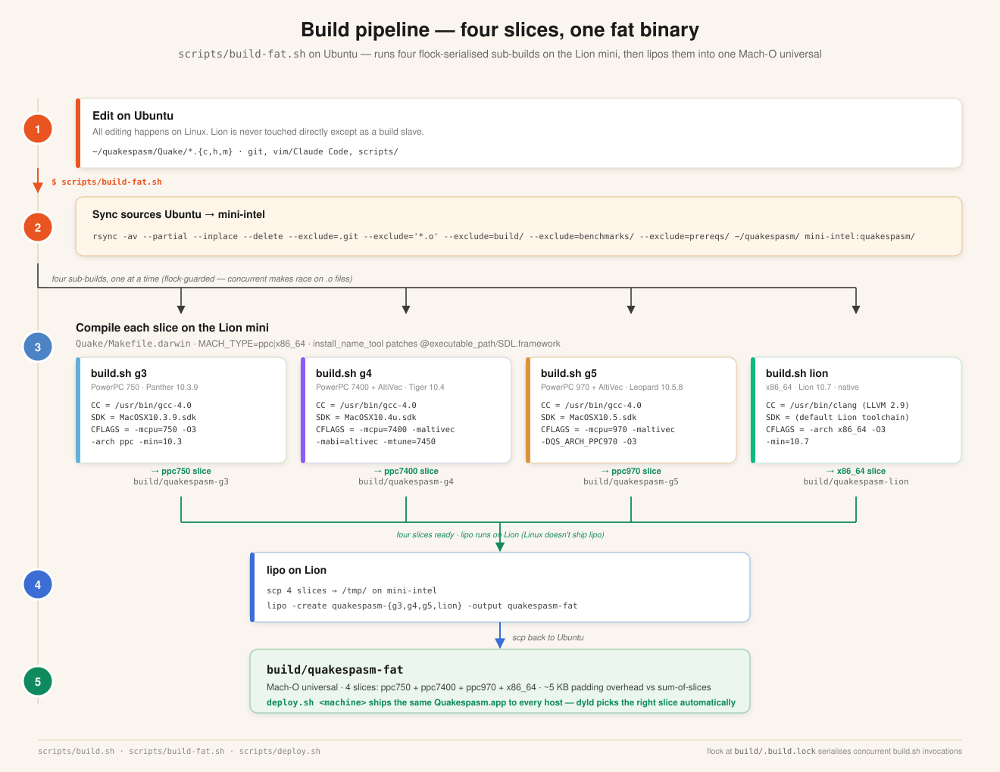
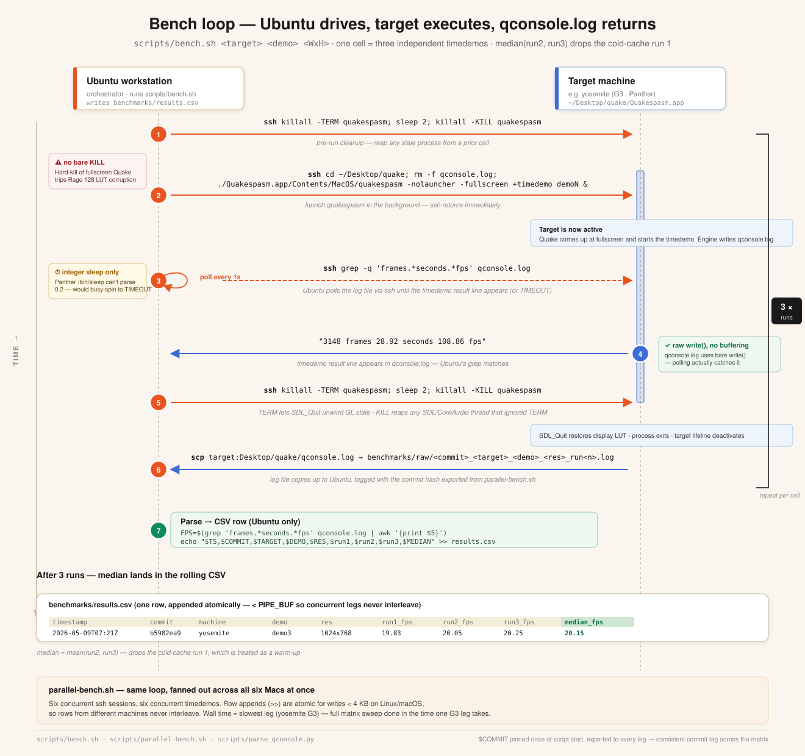

# QuakeSpasm: old-Mac port

[](LICENSE.txt)
[](#tested-machines)
[](#tested-machines)
[](https://github.com/matthewdeaves/old-mac-quakespasm/releases/latest)

<p align="center">
  
</p>

A QuakeSpasm build as one fat PowerPC + Intel binary, tested on a range of old
Macs, G3, G4, G5 and Intel, from a 1999 Power Mac to a 2019 iMac. It reads the
machine model at boot (`sysctl hw.model`) and loads settings tuned to run well on
that hardware.

> **About this project.** A personal project, I love Quake and I collect and
> tinker with old Macs. My part is the setup and testing: the build, deploy and
> benchmark scripts, and the per-machine settings. The engine and config changes
> were made mostly **with AI (Claude), which I directed and checked against real
> benchmarks on the machines**, not hand-written from scratch.

<p align="center">
  
  
  
  
</p>

## Tested machines

| Machine | CPU | GPU | OS | Default res |
|---|---|---|---|---:|
| **Yosemite** (PowerMac1,1 B&W G3, 1999) | 449 MHz PPC 750 | ATI Rage 128 16 MB | 10.3.9 Panther | 800×600 |
| **Yosemite on Tiger** (same Mac, 2nd partition) | 449 MHz PPC 750 | ATI Rage 128 16 MB | 10.4.11 Tiger | 800×600 |
| **Sawtooth** (PowerMac3,1 G4 AGP, 1999) | 500 MHz PPC 7400 | NVIDIA GeForce2 MX 32 MB | 10.4.11 Tiger | 1024×768 |
| **Quicksilver** (PowerMac3,5, 2001) | 733 MHz PPC 7450 | ATI Radeon 9000 Pro 64 MB | 10.4.11 Tiger | 1024×768 |
| **Mac mini G4** (PowerMac10,1, 2005) | 1.25 GHz PPC 7447A | ATI Radeon 9200 32 MB | 10.4.11 Tiger | 1024×768 |
| **iMac G5** (PowerMac8,2, 2005) | 2.0 GHz PPC 970 | ATI Radeon 9600 128 MB | 10.5.8 Leopard | 1440×900 (native) |
| **Mac mini Intel** (Macmini2,1, 2007) | 2.33 GHz Core 2 Duo | Intel GMA 950 64 MB | 10.7.5 Lion | 1024×768 |
| **iMac 27"** (iMac19,1, 2019) | 3.7 GHz Core i5-9600K | AMD Radeon Pro 580X 8 GB | 15.7 Sequoia | 2560×1440 |

### Which OS each CPU needs

The binary carries one slice per CPU family, each stamped with its exact CPU subtype:

| CPU | Slice | OS needed | Tested on |
|---|---|---|---|
| G3 (750) | `ppc750` | 10.3.9 Panther or later | 10.3.9 and 10.4.11 |
| G4 (7400 / 7450 / 7447A) | `ppc7400` | 10.3.9 Panther or later | 10.4.11 |
| G5 (970) | `ppc970` | **10.5 Leopard, a G5 on 10.3 or 10.4 is not supported** | 10.5.8 |
| Intel, 64-bit | `x86_64` | 10.6 Snow Leopard or later | 10.7.5 and 15.7 |

`dyld` picks a slice by CPU alone; the OS plays no part in it. A Mac running an OS
older than its slice needs gets that slice anyway rather than falling back to a lower
one, and won't launch, which is why the G3 and G4 slices are both built at min 10.3
even though no G4 here runs Panther. Two rows are honest about the gap between what
is built and what is tested: **a G4 on Panther and an Intel Mac on Snow Leopard should
both work but neither has been run on hardware** (no such machine in the fleet). The G5
is the exception, its slice genuinely needs 10.5, so that row is a real floor, not a
gap in testing.

32-bit-only Intel Macs (Core Duo / Core Solo, 2006) have no slice at all: there is no
`i386` build, and no such machine here to make one on.

## Framerate

`timedemo demo1`, with the per-machine settings each Mac actually ships with
(translucent water, shadows, dynamic lights, trilinear), median of runs 2 & 3:

| Machine | 1024×768 | 640×480 |
|---|---:|---:|
| Yosemite (G3 / Panther / Rage 128) | 17.2 | 33.6 |
| Yosemite (G3 / Tiger / Rage 128) | 15.9 | 32.5 |
| Quicksilver (G4 / Radeon 9000) | 63.6 | 71.2 |
| Mac mini G4 (Radeon 9200) | 48.7 | 86.0 |
| Mac mini Intel (Lion / GMA 950) | 71.3 | 161.4 |
| Sawtooth (G4 / GeForce2 MX) † | 40.5 | 55.8 |

† Sawtooth was offline for this round; its figures are from the previous
release. Everything else is measured on the v1.14 build.

The iMac G5 runs native 1440×900 only (its Leopard driver hangs on a mode
switch) at ~102 fps; the 2019 iMac sits well over 1500 fps. The G3 ships at
800×600, its default, where demo1 runs 25.5 on Panther and 25.1 on Tiger,
comfortably above 20 fps with everything turned on. That pair is the same Mac
booted from two partitions, running the byte-identical binary out of the same
disk image: the OS costs the G3 a couple of percent and nothing else. Every
machine stays above its target (≥ 60 fps on the G4/G5/Lion machines, ≥ 20 on the
G3); full history and all three demos in
[`benchmarks/results.csv`](benchmarks/results.csv).

## How it's built and benchmarked

One modern Mac drives the whole fleet over SSH. The Lion mini does double duty:
it cross-builds the four PowerPC/Intel slices and benches itself. These diagrams
cover the setup, the build pipeline and the timedemo bench loop.







## Features

- **One fat binary** (PPC G3 + G4 AltiVec + G5 + Intel x86_64); runs on Mac OS X
  10.3.9 Panther through modern macOS. Every PowerPC slice carries its exact CPU
  subtype (`ppc750` / `ppc7400` / `ppc970`) so Tiger and Leopard grade it
  correctly on a G3.
- **Per-machine settings** picked at boot via `sysctl hw.model`, each Mac gets
  a config tuned to stay playable on it. Every setting is a runtime cvar.
- **Visual features**, trilinear + up to 16× anisotropic filtering, alias
  drop-shadows, translucent water / lava / slime / teleporters, watervis on
  un-vis'd maps, emissive-fullbright dynamic lights, `gl_zfix`, and 8× MSAA on
  the modern iMac.
- **Weapon damage decals**, bullet holes, nail pocks, axe slashes, scorch
  stars, burn scars and lightning scars on walls, floors and ceilings (a BSP
  fragment clipper ported from the sister Quake II port; gated via `r_decals`).
- **Online multiplayer**, a server browser (DPMaster query) plus in-protocol
  auto-download, so a 449 MHz G3 and a 2019 iMac can share the same public
  server. Downloads off by default (`allow_download 0`).
- Optional **Apple Watch "tactical computer" companion** (`watchlink`), streams
  the ranger's live state to an iPhone + Watch; off by default. Shared with the
  Quake II port ([quake2-tactical-watch](https://github.com/matthewdeaves/quake2-tactical-watch)).

## Get the latest release

Download the latest disk image from
[**Releases**](https://github.com/matthewdeaves/old-mac-quakespasm/releases/latest)
(`QuakeSpasm-OldMac-<version>.dmg`). One image installs on every supported Mac,
built on Tiger so it mounts on everything from 10.3.9 through modern macOS, and
the `.app` inside is a fat binary that runs natively on each.

Open the `.dmg`, then drag `Quakespasm.app` and `quakespasm.pak` into a folder
(e.g. `~/Desktop/quake/`) next to your own `id1/` containing `pak0.pak`
(shareware) or `pak0.pak` + `pak1.pak` (registered, buy on
[Steam](https://store.steampowered.com/app/2310/QUAKE/) /
[GOG](https://www.gog.com/en/game/quake_the_offering)). Double-click
`Quakespasm.app`. On modern macOS, clear Gatekeeper with
`xattr -dr com.apple.quarantine ~/Desktop/quake/Quakespasm.app` (not needed on
Panther/Tiger/Leopard/Lion). An Apple Silicon Mac now runs a **native `arm64`
slice** rather than the `x86_64` one under Rosetta 2, and the 2006 Core Duo /
Core Solo machines have their own `i386` slice, so there is no longer any Mac
this binary cannot run on natively.

## Sister projects

Same machines, same tooling, other id engines:
[**old-mac-quake2**](https://github.com/matthewdeaves/old-mac-quake2) (Quake II)
and [**old-mac-quake3**](https://github.com/matthewdeaves/old-mac-quake3)
(Quake III Arena).

## License

GPL-2.0-or-later, inherited verbatim from upstream QuakeSpasm. See
[`LICENSE.txt`](LICENSE.txt). Chain: id Software (1996–2001) → John Fitzgibbons /
FitzQuake → QuakeSpasm developers ([sezero/quakespasm](https://github.com/sezero/quakespasm)).
Bundled SDL 1.2.15 is zlib-licensed.

### Where to put it on Apple Silicon and modern macOS

Put the game folder in **`/Applications`**, not on the Desktop.

macOS asks an app for permission before it may read files in Desktop, Documents
or Downloads, and it asks **every launch** for an app it cannot identify
consistently. A game that lives in `/Applications` is outside those protected
locations, so it never triggers the prompt and can read its own `id1/` folder
without being interrupted.

So: drag the whole folder (the `.app` **and** the game data beside it) into
`/Applications`, keeping them together. On first run, clear Gatekeeper with:

```sh
xattr -dr com.apple.quarantine /Applications/<folder>
```

PowerPC and Intel Macs running 10.3 through 10.7 have none of this and can keep
the folder wherever you like.
