# QuakeSpasm — PowerPC Mac port

[](LICENSE.txt)
[](#the-bench-fleet)
[](#the-bench-fleet)
[](https://github.com/sezero/quakespasm)
[](#where-the-wins-came-from)

The best-looking QuakeSpasm I could make run smoothly on six retro Macs spanning **23 years** of Apple hardware — from a 1999 G3 tower running Mac OS X Panther, to a 2019 iMac on Sequoia.

One source tree, one fat universal binary (PPC G3 + PPC G4 AltiVec + Intel x86_64), and a per-machine config that picks itself at boot via `sysctl hw.model`.

The hard floor: **every machine stays comfortably playable.** No fps win that hurt visuals on any target made it in.

<p align="center">
  
  
  
  
</p>
<p align="center"><sub><i>Same engine, four GPU eras: GeForce2 MX (fixed-function) → Radeon 9000 (shader water) → GMA 950 (Lion fallback) → Radeon Pro 580X (1440p modern).</i></sub></p>

## The bench fleet

| Machine | CPU | GPU | OS |
|---|---|---|---|
| **Yosemite** (PowerMac1,1 B&W G3, 1999) | 449 MHz PPC 750 | ATI Rage 128 16 MB | 10.3.9 Panther |
| **Sawtooth** (PowerMac3,1 G4 AGP, 1999) | 500 MHz PPC 7400 | NVIDIA GeForce2 MX 32 MB | 10.4.11 Tiger |
| **Quicksilver** (PowerMac3,5, 2001) | 733 MHz PPC 7450 | ATI Radeon 9000 Pro 64 MB | 10.4.11 Tiger |
| **Mac mini G4** (PowerMac10,1, 2005) | 1.25 GHz PPC 7447A | ATI Radeon 9200 32 MB | 10.4.11 Tiger |
| **Mac mini Intel** (Macmini2,1, 2007) | 2.33 GHz Core 2 Duo | Intel GMA 950 64 MB | 10.7.5 Lion |
| **iMac 27"** (iMac19,1, 2019) | 3.7 GHz Core i5-9600K | AMD Radeon Pro 580X 8 GB | 15.7.5 Sequoia |

The fleet covers four GPU eras: fixed-function (Rage 128, GeForce2 MX), early shader-era ATI (Radeon 9000/9200), Intel integrated GMA, and a modern AMD discrete part. Different bottlenecks at every level — which is what makes the matrix interesting.

## How fast does it go?

Median fps from a 90-shot timedemo (`demo1`/`demo2`/`demo3`) at the resolution each machine ships at by default:

| Machine | demo1 | demo3 (heavier) | Default res |
|---|---:|---:|---:|
| Yosemite (G3 / Rage 128) | 24.20 | 20.25 | 1024×768 |
| Sawtooth (G4 / GeForce2 MX) | 57.95 | 47.75 | 1024×768 |
| Quicksilver (G4 / Radeon 9000) | 110.85 | 85.75 | 1024×768 |
| Mac mini G4 (G4 / Radeon 9200) | 76.05 | 67.00 | 1024×768 |
| Mac mini Intel (Lion / GMA 950) | 96.40 | 44.85 | 1024×768 |
| iMac 27" (Intel / Radeon Pro 580X) | ~2000 | ~2000 | 2560×1440 |

The G3 is the floor target at 20 fps on the heaviest demo — playable but tight. Everything else clears 45+ fps with room.

## What each machine actually renders

Same engine, very different visual stacks. The fat binary's per-machine layer (`autoexec-<machine>.cfg`, picked by `sysctl hw.model` at boot) tunes each cell to its hardware:

|  | demo1 (e1m1) | demo2 (e1m3) | demo3 (e1m8) |
|---|---|---|---|
| **Sawtooth** (GeForce2 MX, fixed-function) |  | 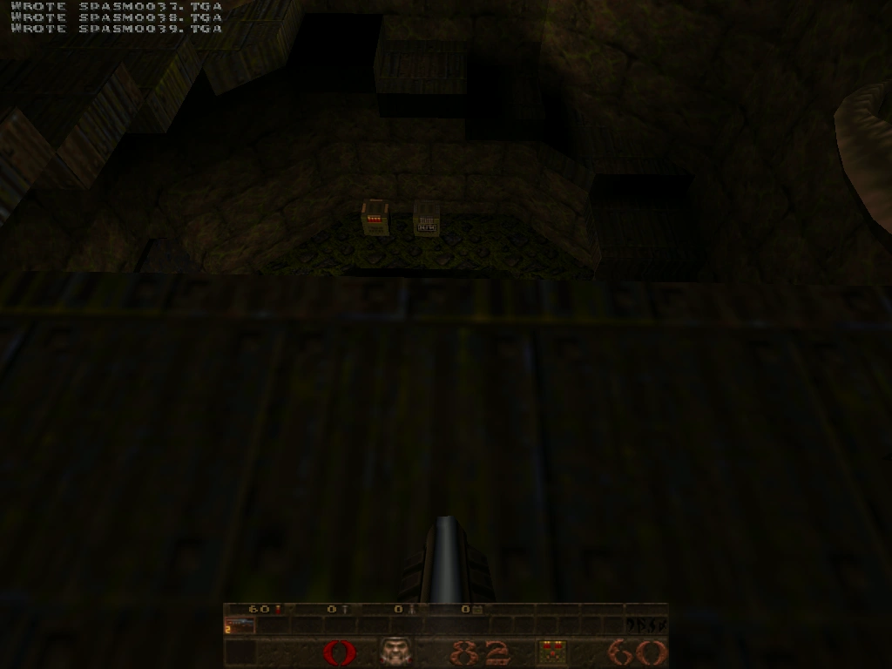 | 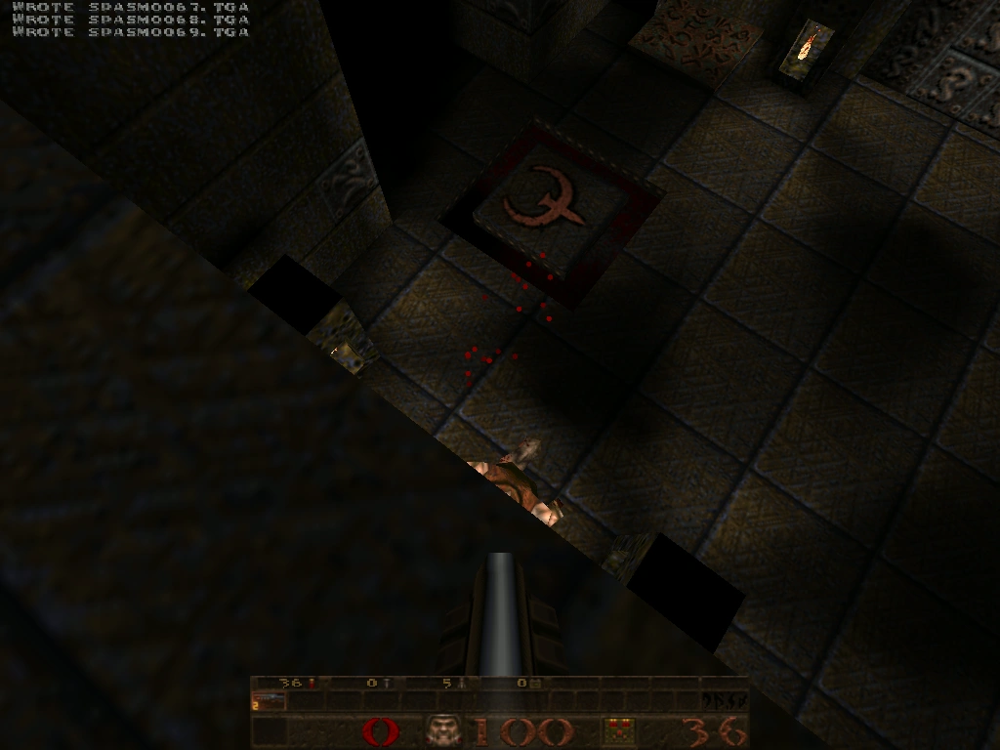 |
| **Quicksilver** (Radeon 9000, shader water) | 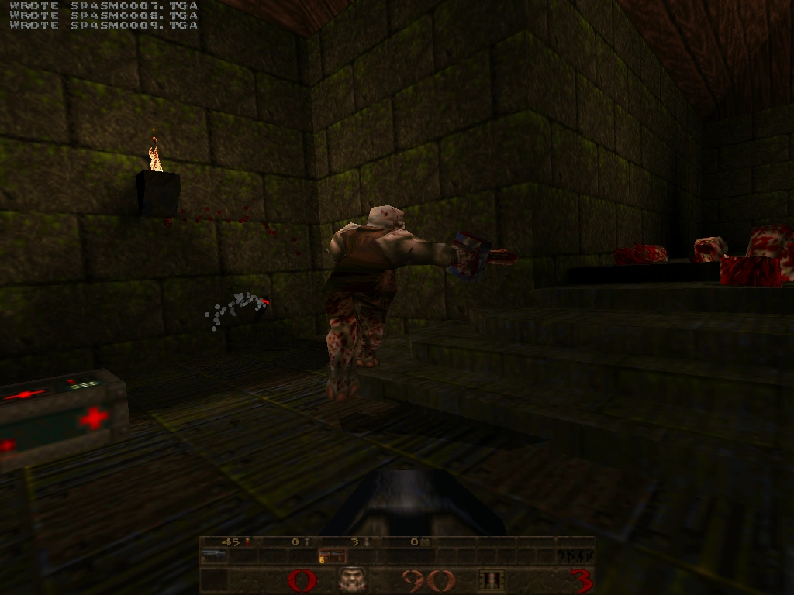 |  | 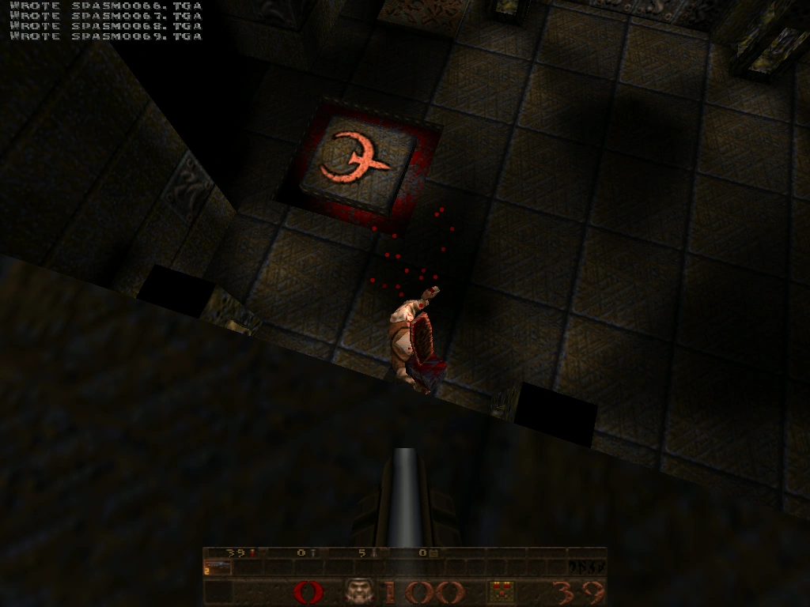 |
| **Mac mini G4** (Radeon 9200) | 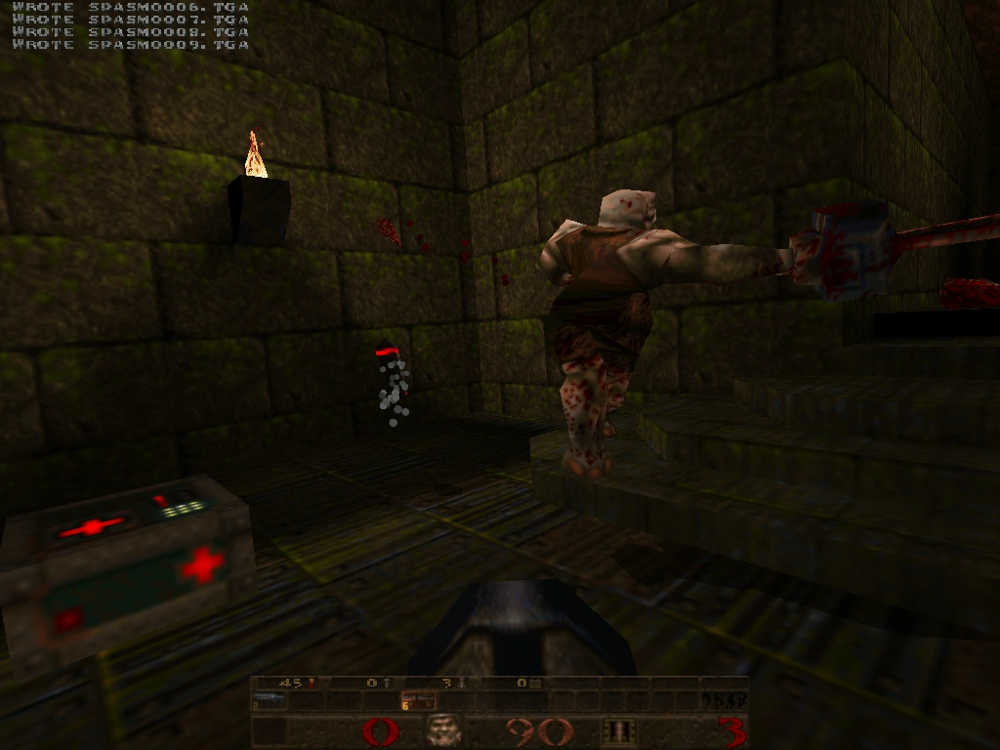 | 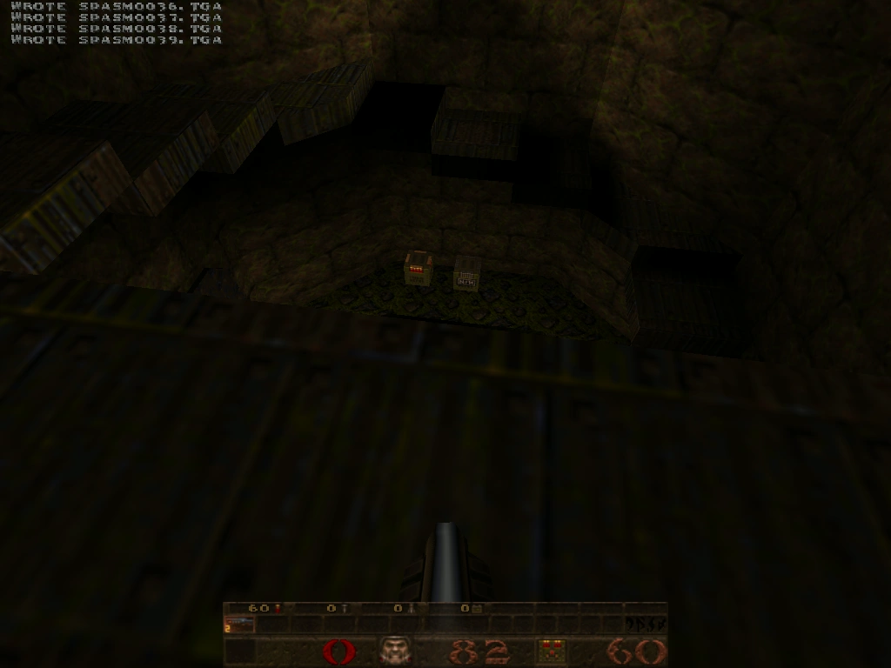 | 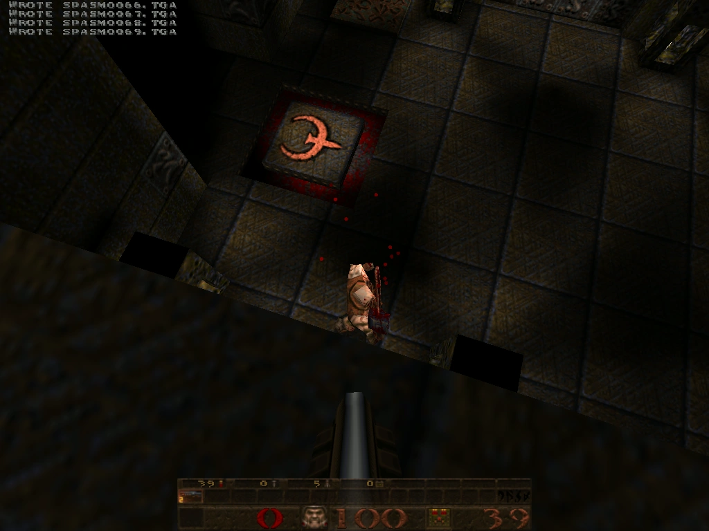 |
| **Mac mini Intel** (GMA 950, Lion) | 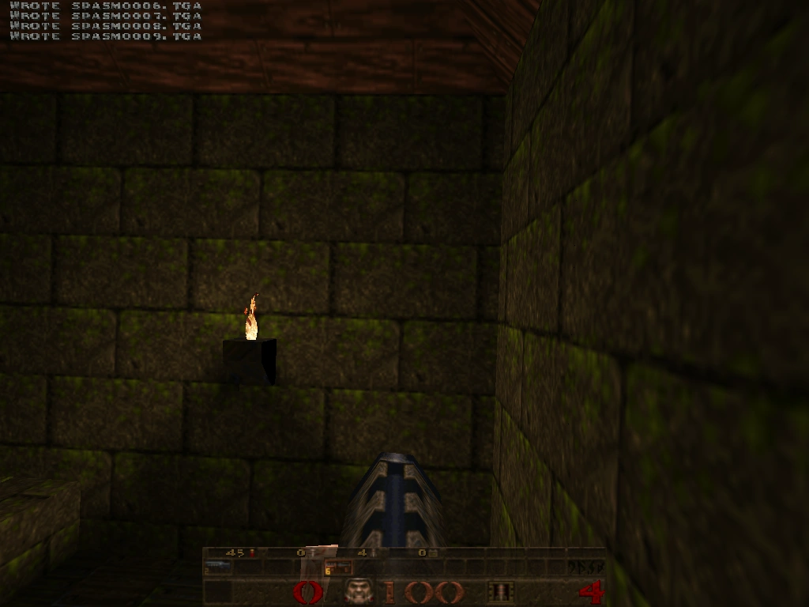 | 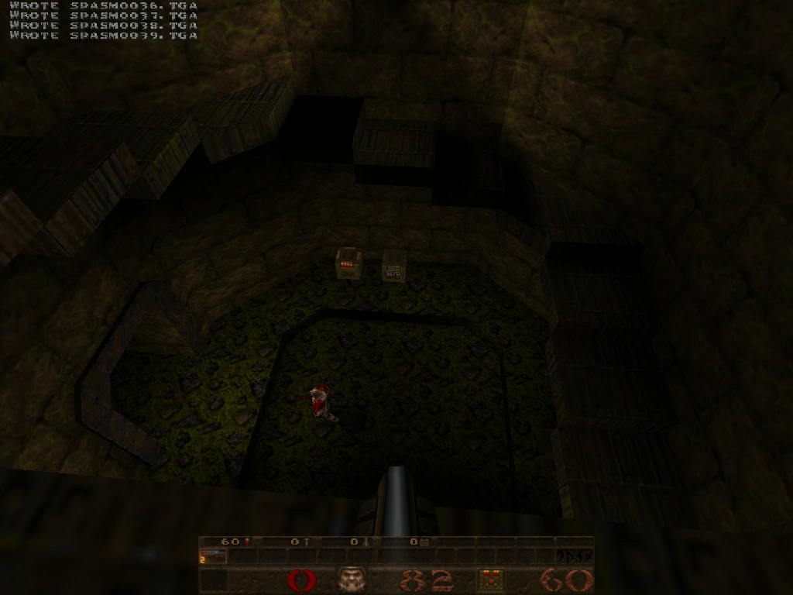 |  |
| **iMac 27"** (Radeon Pro 580X, 1440p) |  | 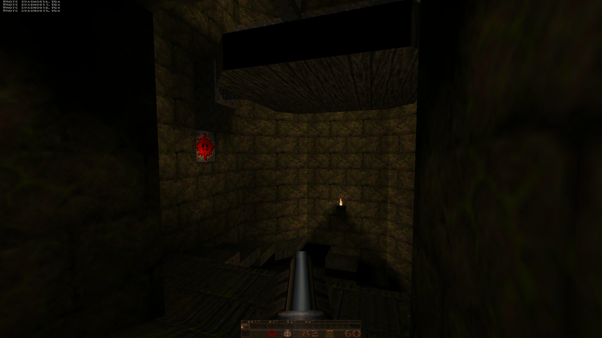 | 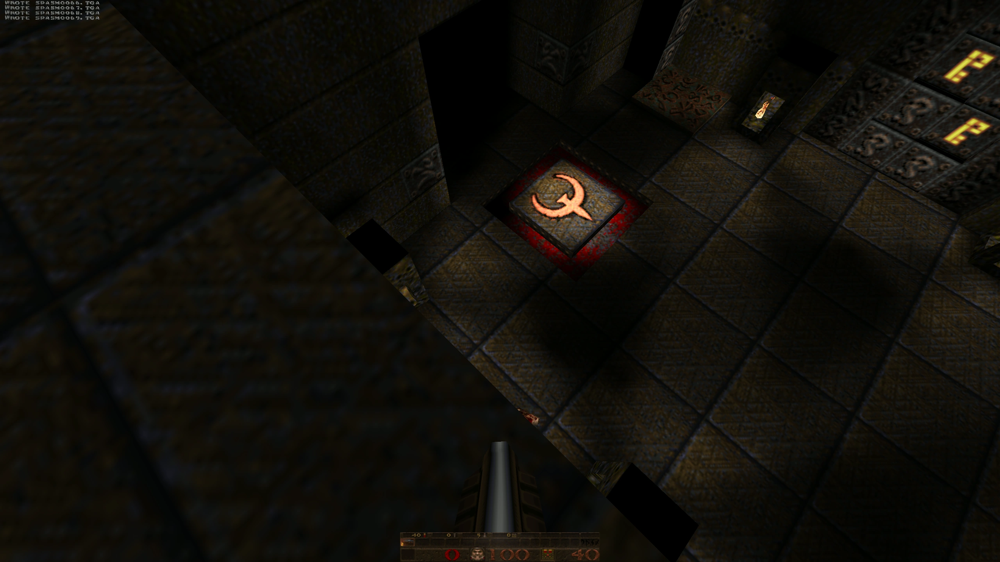 |

## Where the wins came from

Roughly in order of gain:

- **Distance gates** for shadows + dynamic lights (`r_shadow_distance`, `r_dynamic_distance`) — biggest G3 lever, since each dlight on a fixed-function GPU is a full extra blending pass.
- **AltiVec hand-paths** for sound mixer, alias model lerp, alias colour-fuse, lightmap compose, mipmap chain, dlight per-texel attenuation. Bisectable behind cmdline opt-outs (`-noaltivec-snd`, `-altivec-lm`, etc.).
- **`frsqrte`-based sqrt** in the math library hot loops (vec3 length / normalize) — base PowerPC instruction, helps both G3 and G4.
- **APPLE_vertex_array_range** static-brush VRAM pool on G4 — moves the world geometry into video memory at load time so the per-frame submission is a pointer flip instead of a memcpy.
- **APPLE_client_storage + STORAGE_CACHED_APPLE** texture upload hints — avoids the GL-internal copy of mipmap chains.
- **BGRA `8_8_8_8_REV` lightmap upload format** — matches the GL driver's preferred channel order so the upload skips a swizzle.
- **`gl_clear 0`** on 4 of 5 targets — Quake covers 100% of the screen anyway, so the per-frame backbuffer clear is a redundant fillrate-bound write. Sawtooth's GeForce2 MX driver is quirky here and stays at engine default 1.

The cumulative gain across the round is in `PPC_PLAN.md §15`.

## How the universal binary picks its config

```
host.c  →  exec quake.rc           (engine defaults)
        →  exec autoexec-ppc750.cfg / -ppc7400.cfg / -x86_64.cfg   (per-arch baseline,
                                                                    picked by __VEC__ /
                                                                    __ppc__ / __x86_64__)
        →  exec autoexec-<machine>.cfg                              (per-machine layer,
                                                                     picked by hw.model
                                                                     sysctl)
```

Each layer can override the previous. So Sawtooth (G4 / GeForce2 MX) starts from the G4 baseline that pushes shaders + trilinear, then `autoexec-sawtooth.cfg` walks back the bits that would tank fixed-function performance. iMac 27" starts from the x86_64 baseline (tuned for GMA 950) and overrides upward to push 1440p with the full alpha stack.

## Build and ship

The full build/deploy/bench loop is scripted. Don't write inline ssh+make heredocs — invoke the scripts:

```bash
scripts/build-fat.sh                    # 3-arch universal binary
scripts/deploy.sh fat <machine>         # ship to one of the 6 hosts
scripts/bench.sh <machine> demo1 1024x768 3   # 3 timedemo runs, append to results.csv
scripts/parallel-bench.sh               # full matrix, all 5+ legs concurrent
```

Cross-builds happen on the Mac mini Intel (the only machine left with a working `gcc-4.0` + `MacOSX10.3.9.sdk` + `MacOSX10.4u.sdk` toolchain). PPC binaries are built there over SSH; the same machine doubles as a runtime target via native x86_64 builds.

## Dig deeper

- **`PPC_PLAN.md`** — the working doc. Every phase, every decision, every reverted experiment.
- **`MISTAKES.md`** — append-only log of approaches that broke and why. Read this before relighting any "easy" idea.
- **`CLAUDE.md`** — operational tribal knowledge: SSH legacy crypto, Tiger/Panther bundle layout, why `bench.sh` legs don't run in parallel from one shell, the `qsreboot.sh` recovery path for wedged G3s, etc.
- **`analysis/INDEX.md`** — static-analysis tooling state. cppcheck, gcc -fanalyzer, clang-tidy, scan-build, sparse, ASan, UBSan all wired against the Linux build.
- **`scripts/README.md`** — script contracts.

## License

Upstream QuakeSpasm is GPL-2.0 — see `LICENSE.txt`. All port work in this fork follows the same license.
